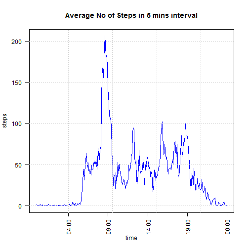

---
output:
  html_document: default
---
---
title: "Reproducible Research: Peer Assessment 1"
output: 
  html_document:
    keep_md: true

## Loading and preprocessing the data

```r
activity <- read.csv("activity.csv",header=TRUE)
```
Converting the interval to a time format (POSIXlt) and adding the column to the dataset

```r
hour <- trunc(activity$interval/100)
minute <- activity$interval - hour*100
hour <- strptime(hour,"%H")
minute <- strptime(minute,"%M")
time <- paste(as.character(format(hour, "%H")),as.character(format(minute, "%M")),sep=":")
time <- strptime(time,format="%H:%M")
activity <- cbind(activity,time)
str(activity)
```

```
## 'data.frame':	17568 obs. of  4 variables:
##  $ steps   : int  NA NA NA NA NA NA NA NA NA NA ...
##  $ date    : Factor w/ 61 levels "2012-10-01","2012-10-02",..: 1 1 1 1 1 1 1 1 1 1 ...
##  $ interval: int  0 5 10 15 20 25 30 35 40 45 ...
##  $ time    : POSIXct, format: "2015-05-14 00:00:00" "2015-05-14 00:05:00" ...
```

## What is mean total number of steps taken per day?
1. Calculating the total number of steps taken in a day by aggregating all the steps in the day. Days with NAs input are ignored


```r
activity$date <- as.Date(activity$date)
totsteps <- aggregate(steps~date, data=activity, sum)
```
2. Creating the histogram - Plotting the frequency of the total number of steps taken each day


```r
x <- seq(0,22000,1000)
with(totsteps, hist(steps,breaks = x, col=rainbow(7)))
```

 

3. Calculate the mean and median of the total steps taken in a day
   The results are plotted as a line chart.

```r
Meansteps   <- aggregate(steps~date, data=activity,mean)
Mediansteps <- aggregate(steps~date, data=activity,median)
par(mfrow = c(2,1))
plot(Meansteps$date,Meansteps$steps,type="l",xlab ="Date", ylab= "Mean No of Steps",col="darkgreen")
plot(Mediansteps$date,Mediansteps$steps,type="l",xlab="Date", ylab="Median No of Steps",col="red")
```

 

## What is the average daily activity pattern?

1. Make a time series plot (i.e. type = "l") of the 5-minute interval (x-axis) and the average number of steps taken, averaged across all days (y-axis)

```r
dailypattern <- aggregate(steps~time, data=activity, mean)
with(dailypattern, plot(steps~time,type = "l",col="blue",las=2))
grid()
title(main="Average No of Steps in 5 mins interval")
```

 

2. Which 5-minute interval, on average across all the days in the dataset, contains the maximum number of steps?

```r
order(dailypattern[,2])
```

```
##   [1]   9  17  24  25  26  28  29  31  33  34  37  38  39  40  47  48  52
##  [18]  61 279   5  46 274   3  12  30   4  15  20  21  41  32 287  23  11
##  [35]  13 273   2  16  53  54  22  45   7  44  42 286  56  14  58 280   8
##  [52]  36  50 281 288  18  60  27  49 265  10  35  62 282 275  43   1  19
##  [69]   6  67 272  64  51 283 264 278  66  63  59 277 285  65  57 266  55
##  [86] 276 284 267  68 269 262 258 263 268 261 270 271 257 259 253  69 260
## [103] 177 254  70 242 256 243 249 241 252 234 120 246 135 250 248 255 117
## [120] 131 164 136 238 178 138 153 245 122 247 235 176 130 137 134 181 237
## [137] 133  73 132 251 152 244 139 240 129 215 119 173 183 182 233  83 128
## [154] 216 174 154 200 118 184 125  80  71 158 165 236 121 217 160 175 141
## [171] 157 123 163 159 171 179 204 180  85 199  81  82 127  92  86  72 142
## [188] 201 155 116 202 239 185 143 203 161 205  78 167 186 187 172  84  74
## [205]  89  77 140 150  87 207 126  90 170  79  93 124 232 166  75 151  88
## [222]  91 169  96 206 162 214 197  95 218 231 144 221 212 198 168 208 193
## [239] 196 149  76 145 194 188 115 156 222  98 211  94 209  97 224 195 219
## [256] 213 223 230 210 189 192 229 220 225 228 227 146 148 147 114 190 226
## [273] 191 113 112 111 110  99 109 102 100 108 101 103 106 107 105 104
```

```r
answer <- dailypattern[order(dailypattern[,2])[288],]  ## The last item has the highest number
answer
```

```
##                    time steps
## 104 2015-05-14 08:35:00 206.2
```
#### The highest average number in a 5-min interval is 206.1698 
#### and the time is 08:35    
  

## Imputing missing values

1. Calculate and report the total number of missing values in the dataset (i.e. the total number of rows with NAs)

```r
NAs <- is.na(activity$steps)
sum_NAs <- sum(NAs)
```
#### The total number of rows with NAs is 2304   


2. Devise a strategy for filling in all of the missing values in the dataset. 
   - The strategy will be to replace the missing values with the mean of the total steps

```r
names(dailypattern) <- c("time","mean")
activity1 <- merge(activity,dailypattern,by.x="time",by.y="time")
for (x in 1:length(activity1$steps)){
    if (is.na(activity1$steps[x])){activity1$steps[x] <- activity1$mean[x]}
    }
```

3. Create a new dataset that is equal to the original dataset but with the missing data filled in. The structure of the new and old dataset is shown

```r
str(activity1)
```

```
## 'data.frame':	17568 obs. of  5 variables:
##  $ time    : POSIXct, format: "2015-05-14 00:00:00" "2015-05-14 00:00:00" ...
##  $ steps   : num  1.72 0 0 0 0 ...
##  $ date    : Date, format: "2012-10-01" "2012-11-23" ...
##  $ interval: int  0 0 0 0 0 0 0 0 0 0 ...
##  $ mean    : num  1.72 1.72 1.72 1.72 1.72 ...
```

```r
str(activity)
```

```
## 'data.frame':	17568 obs. of  4 variables:
##  $ steps   : int  NA NA NA NA NA NA NA NA NA NA ...
##  $ date    : Date, format: "2012-10-01" "2012-10-01" ...
##  $ interval: int  0 5 10 15 20 25 30 35 40 45 ...
##  $ time    : POSIXct, format: "2015-05-14 00:00:00" "2015-05-14 00:05:00" ...
```
4. Make a histogram of the total number of steps taken each day and Calculate and report the mean and median total number of steps taken per day. Do these values differ from the estimates from the first part of the assignment? What is the impact of imputing missing data on the estimates of the total daily number of steps?

```r
totsteps1 <- aggregate(steps~date, data=activity1, sum)
x <- seq(0,22000,1000)
with(totsteps1, hist(steps,breaks = x, col=rainbow(7)))
grid()
```

 

```r
Meansteps1   <- aggregate(steps~date, data=activity1,mean)
Mediansteps1 <- aggregate(steps~date, data=activity1,median)
par(mfrow = c(1,2),oma=c(0,0,2,0),mar=c(2,2,2,2))
plot(Meansteps$date,Meansteps$steps,type="l",xlab ="Date", ylab= "Mean No of Steps",col="darkgreen")
plot(Mediansteps$date,Mediansteps$steps,type="l",xlab="Date", ylab="Mean No of Steps",col="red")
mtext("Mean and Median Plot before imputaton",outer=TRUE)
```

 

```r
par(mfrow = c(1,2),oma=c(0,0,2,0),mar=c(2,2,2,2))
plot(Meansteps1$date,Meansteps1$steps,type="l",xlab ="Date", ylab= "Mean No of Steps",col="blue")
plot(Mediansteps1$date,Mediansteps1$steps,type="l",xlab="Date", ylab="Mean No of Steps",col="orange")
mtext("Mean and Median Plot after imputaton",outer=TRUE)
```

 

## Are there differences in activity patterns between weekdays and weekends?

1. Create a new factor variable in the dataset with two levels - "weekday" and "weekend" indicating whether a given date is a weekday or weekend day.


```r
activity1$date <- as.Date(activity1$date)
daysofweek <- weekdays(activity1$date)
days <- daysofweek
## Check for weekdays or weekends
for (x in 1:length(daysofweek)){
    if (daysofweek[x] == "Saturday" | daysofweek[x] == "Sunday")
    {days[x] <- "Weekend"}
    else
    {days[x] <- "Weekday"}
}
activity1 <- cbind(activity1,days,daysofweek)
```
2. Make a panel plot containing a time series plot (i.e. type = "l") of the 5-minute interval (x-axis) and the average number of steps taken, averaged across all weekday days or weekend days (y-axis). 

```r
library(ggplot2)
library(scales)
dailypattern1 <- aggregate(steps~time+days, data=activity1, mean)
ggplot(dailypattern1, aes(x= time, y=steps)) +
    geom_line() +
    facet_grid(days~.) +
    scale_x_datetime(labels = date_format("%H:%M"),breaks = date_breaks("2 hour")) +
    labs(title="Daily Plot - Average No of Steps in 5 mins interval")
```

 

